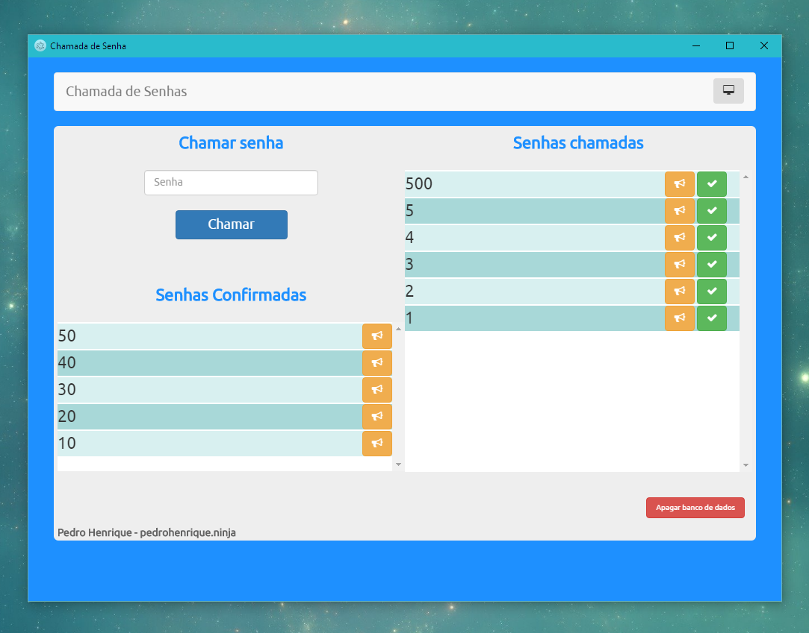
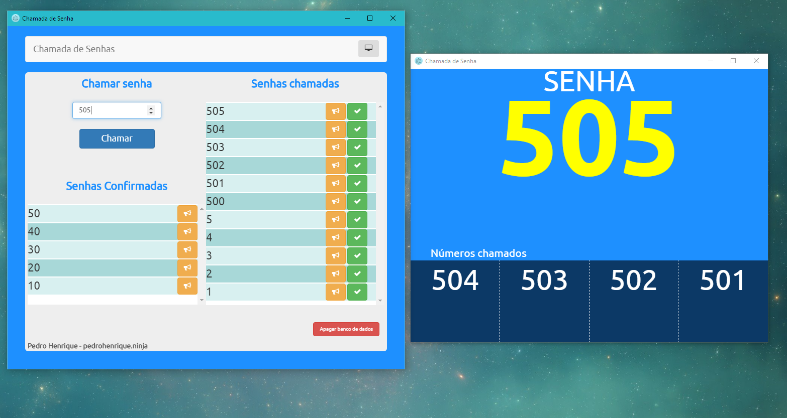
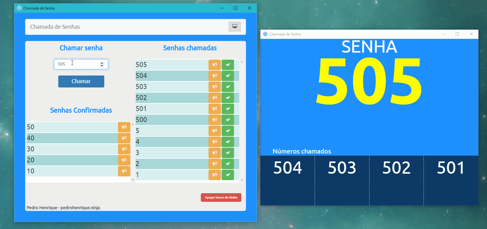

### Chamador de Senhas
-----

Aplicativo de display de senhas estilo Guiche

## Preview

## Uso

Este aplicativo utiliza **Electron** para ser executado, o banco de dados é armazendo na pasta do aplicativo. 
O aplicativo é composto por duas janelas, uma do atendente e uma do painel.

Para utilizar este aplicativo baixe a última build do Electron and coloque a pasta app dentro da pasta `resources` do Electron.

Para executar basta abrir o arquivo `electron.exe`.

**NOTA:** Sim, estou colocando as dependências dentro da pasta `app` para facilitar a instalação, já que durante o desenvolvimento encontrei diversos problemas com diferentes versões de arquivos das dependências.
